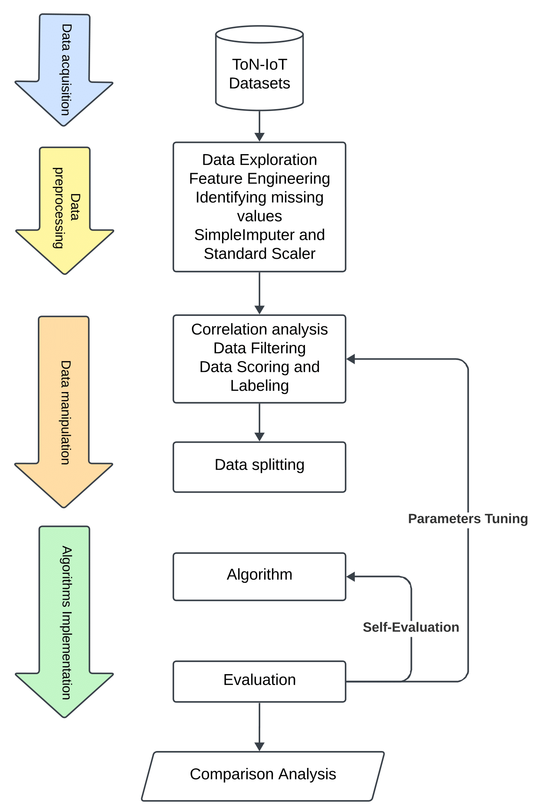
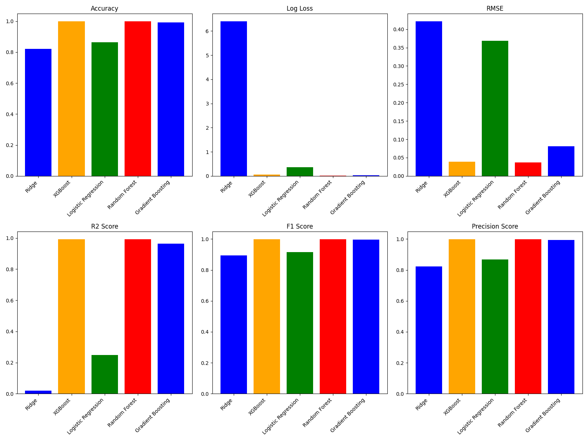

# Evaluating the Performance of Machine Learning-Based Classification Models for IoT Intrusion Detection

<a href="https://doi-org.libpublic3.library.isu.edu/10.1109/ORSS62274.2024.10697949"></a> 
<a href="https://www.researchgate.net/publication/384580344_Evaluating_the_Performance_of_Machine_Learning-Based_Classification_Models_for_IoT_Intrusion_Detection"></a>

## Abstract
As the Internet of Things (IoT) continues to expand its footprint across various sectors, including healthcare, industrial automation, and smart homes, the security of these interconnected devices becomes paramount. With the proliferation of IoT devices, the attack surface for potential cybersecurity threats has significantly increased, necessitating the development of efficient Intrusion Detection Systems (IDS). This study embarks on a comprehensive examination of several machine learning algorithms aimed at enhancing the prediction accuracy of IDS within IoT networks. Leveraging the ToN-IoT dataset, we implement and compare the effectiveness of models. The findings reveal that ensemble methods, particularly Random Forest and XGBoost, exhibit superior performance, underscoring their potential for deployment in safeguarding IoT ecosystems against malicious intrusions. <br>
## ToN-IoT Dataset

## System model


## Running the code

## Results
The main results are illustrated in the table and figure below:

## Citation
Please do not hesitate to contribute to this project and cite us:
```
@INPROCEEDINGS{10697949,
  author={Kaddour, Hamza and Das, Shaibal and Bajgai, Rishikesh and Sanchez, Amairanni and Sanchez, Jason and Chiu, Steve C. and Ashour, Ahmed F. and Fouda, Mostafa M.},
  booktitle={2024 IEEE Opportunity Research Scholars Symposium (ORSS)}, 
  title={Evaluating the Performance of Machine Learning-Based Classification Models for IoT Intrusion Detection}, 
  year={2024},
  volume={},
  number={},
  pages={84-87},
  keywords={Machine learning algorithms;Biological system modeling;Ecosystems;Intrusion detection;Smart homes;Predictive models;Data models;Internet of Things;Random forests;Optimization;IoT security;intrusion detection systems;cyber-security threats;IoT networks;malicious intrusions;safeguarding IoT ecosystems},
  doi={10.1109/ORSS62274.2024.10697949}}
```

If you find this project interesting, please do not hesitate to reach out to me for any recommendations, questions, or suggestions.
[Email me](mailto:hamzakaddour@isu.edu)
